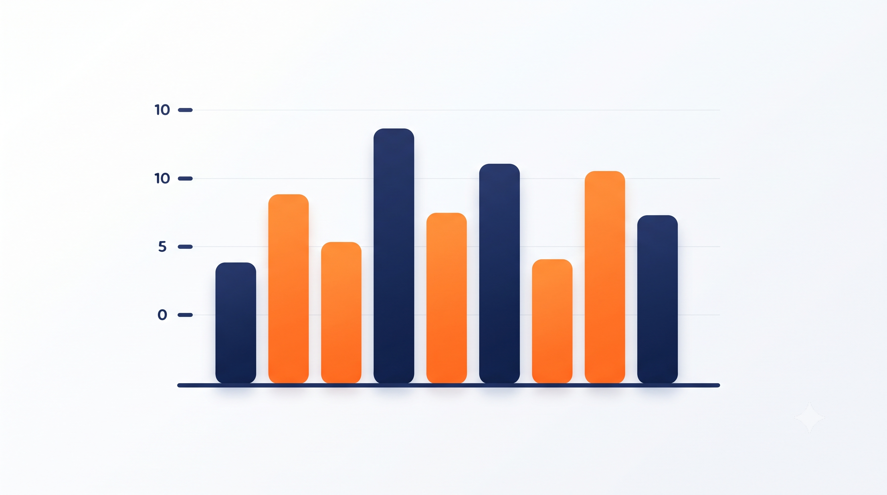
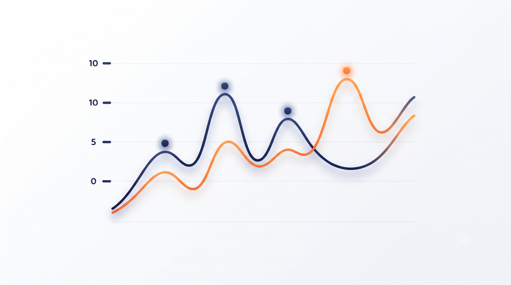
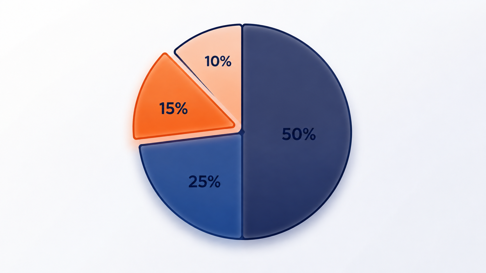
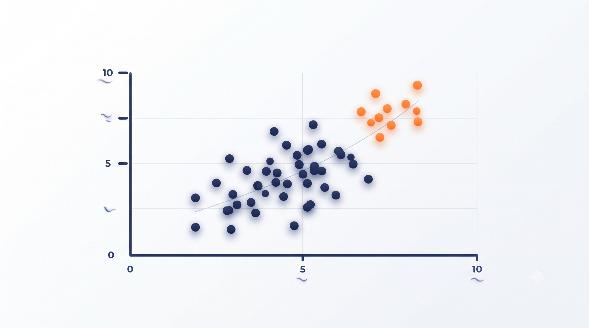
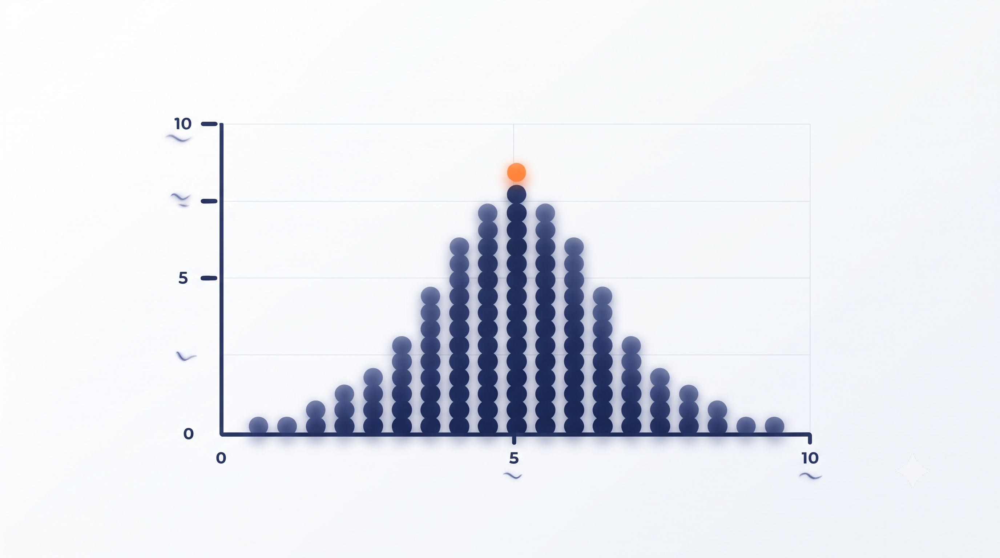
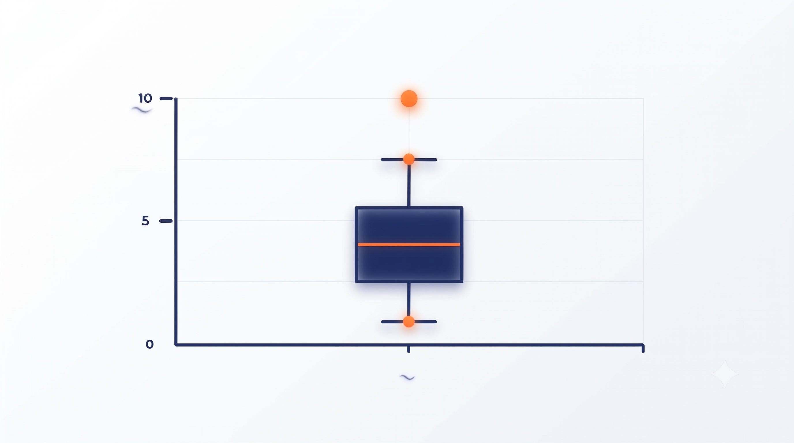
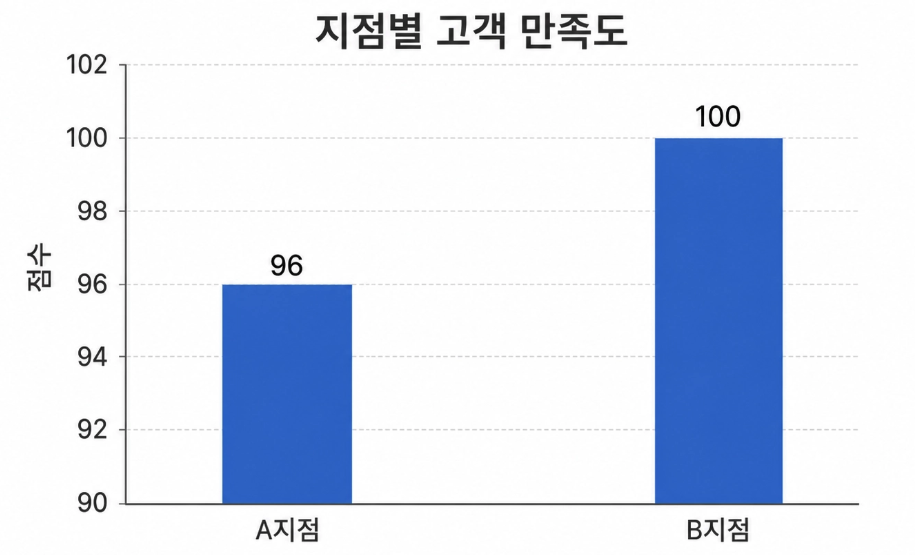
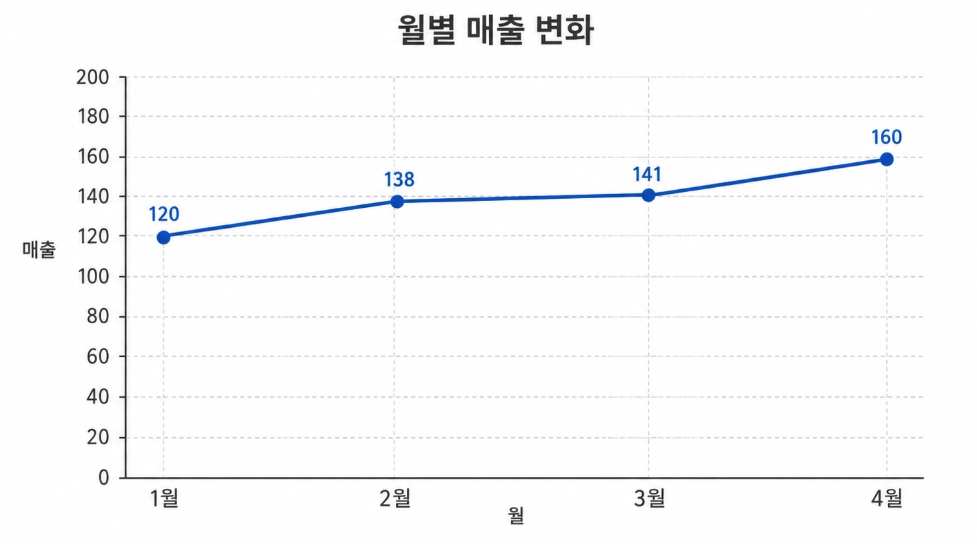
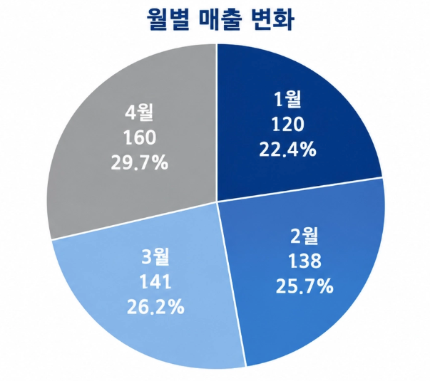
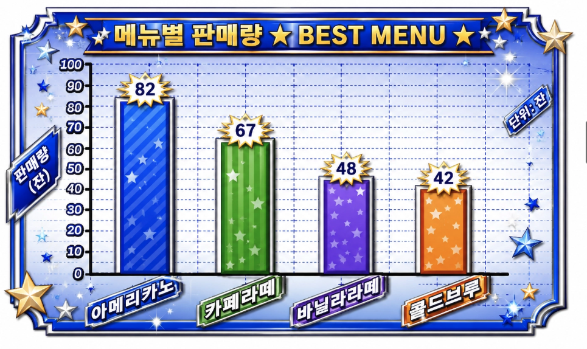

## 🎯 학습 목표
1. 데이터·정보·빅데이터와 데이터 유형의 차이를 이해하고, 데이터가 수집 → 저장 → 처리 → 분석 → 활용되는 과정을 설명할 수 있다
2. 데이터 품질과 표본의 대표성을 확인하고, 평균·중앙값·최빈값·비율·상관관계를 상황에 맞게 해석할 수 있다
3. 분석 목적에 맞는 그래프를 선택하고 축·단위·범위·구간·비교 기준을 확인해 잘못되거나 왜곡된 시각화를 판별할 수 있다
---
<table fit-page-width="true" header-row="true">
<colgroup>
<col width="454">
<col width="259.359375">
</colgroup>
<tr>
<td>고민해볼 문제</td>
<td>이번 주차에서 연결되는 내용</td>
</tr>
<tr>
<td>데이터가 많으면 분석 결과도 자동으로 더 정확해질까?</td>
<td>빅데이터와 데이터 품질</td>
</tr>
<tr>
<td>숫자로 저장되어 있으면 모두 같은 방식으로 계산해도 될까?</td>
<td>데이터의 의미와 유형</td>
</tr>
<tr>
<td>평균이 같으면 두 집단의 상황도 같다고 볼 수 있을까?</td>
<td>대표값과 분포</td>
</tr>
<tr>
<td>설문 응답자가 많으면 전체 사람들의 의견을 대표한다고 볼 수 있을까?</td>
<td>표본과 대표성</td>
</tr>
<tr>
<td>같은 데이터도 그래프를 어떻게 그리느냐에 따라 다르게 보일 수 있을까?</td>
<td>데이터 시각화</td>
</tr>
</table>
---
<callout color="green_bg">
	데이터 리터러시는 숫자를 계산하는 능력만을 의미하지 않으며 무엇을 어떤 기준으로 수집했는지, 데이터가 어떤 과정을 거쳐 분석 결과가 되었는지, 표와 그래프가 무엇을 강조하거나 생략하고 있는지까지 이해하고 판단하는 능력과 연결
</callout>
---
# 1. 빅데이터 개념과 데이터 분석 기초
## 1.1 데이터와 정보
데이터는 관찰·측정·기록된 값이며, 정보는 데이터에 목적과 맥락을 더해 해석 가능한 의미로 만든 결과
- 데이터는 아직 해석되지 않은 재료에 가깝기 때문에 숫자나 문장만 보고는 그것이 무엇을 뜻하는지 알기 어려울 수 있음
- 데이터가 어떤 대상·시점·단위에 관한 것인지 설명하고 필요한 기준으로 비교하거나 정리하면 판단에 사용할 수 있는 정보가 됨
- 따라서 데이터를 볼 때는 값 자체보다 다음을 함께 확인해야 함
	- 무엇을 측정했는가
	- 어떤 단위를 사용했는가
	- 어느 기간의 값인가
	- 누가 어떤 방법으로 수집했는가
	> 예시) 23, 25, 31이라는 숫자만으로는 의미를 알기 어렵지만 최근 3일간 도서관 방문자 수라는 설명과 단위가 붙으면 무엇을 나타내는지 이해할 수 있음
---
## 1.2 빅데이터
빅데이터는 기존 방식으로 다루기 어려울 정도로 규모가 크거나 생성 속도가 빠르고 형태가 다양한 데이터를 의미
- 단순히 파일 하나가 매우 크다는 뜻만이 아니라, 데이터가 계속 쌓이고 여러 형식이 섞여 있어 사람이 직접 확인하거나 일반적인 문서 도구로 처리하기 어려운 상태를 포함
- 빅데이터를 활용하려면 많은 데이터를 저장하는 기술뿐 아니라 필요한 내용을 빠르게 찾고 분석할 수 있는 방법도 함께 필요
	- **규모**: 데이터의 양이 많음
	- **속도**: 짧은 시간에 계속 생성됨
	- **다양성**: 숫자·텍스트·이미지·음성·영상 등 여러 형태
- 중요한 점은 데이터가 크다는 사실 자체보다 많은 데이터를 목적에 맞게 처리하고 의미 있는 결과로 활용할 수 있는가에 있음
> 예시) 온라인 쇼핑몰에는 구매 기록뿐 아니라 검색어·클릭·장바구니·리뷰·문의 내용 등이 함께 쌓일 수 있으며, 각각 다른 형식과 의미를 가짐
---
## 1.3 데이터 유형
AI가 다루는 데이터가 다양해지면서 숫자뿐 아니라 이미지와 텍스트도 중요한 분석 대상이 됨
- **정형 데이터**: 행과 열처럼 구조가 일정해 표 형태로 저장하기 쉬운 데이터로, 고객번호·날짜·구매금액·수량·점수 등이 해당. 각 항목의 위치와 형식이 정해져 있어 조건에 맞는 값을 찾거나 합계·평균을 계산하기 쉬움
- **비정형 데이터**: 고정된 표 구조가 없는 데이터로, 문장·이미지·음성·영상 등이 해당. 내용과 길이가 일정하지 않기 때문에 그대로 계산하기 어렵고, 분석 목적에 맞는 특징이나 의미를 먼저 찾아야 함
> 예시) 고객 의견을 분석하려면 자유롭게 작성된 문장에서 주제나 감정과 같은 특징을 찾아 정리해야 하며, 이처럼 데이터 형태에 따라 저장·처리·분석 방법도 달라질 수 있음
---
## 1.4 데이터 분석의 기본 질문
데이터 분석은 도구를 먼저 실행하는 것이 아니라 어떤 질문에 답하려는지 분명히 하는 것에서 시작
- 같은 데이터라도 전체 규모를 알고 싶은지, 집단별 차이를 비교하려는지, 시간에 따른 변화를 확인하려는지에 따라 살펴볼 항목과 계산 방법이 달라짐
- 질문을 먼저 정해야 어떤 데이터가 필요하고 어떤 결과를 만들지 판단할 수 있으며, 분석 범위를 벗어난 결론을 내리는 것도 줄일 수 있음
기본적으로 확인할 질문
- 어떤 현상을 알고 싶은가
- 비교할 집단이나 기간이 있는가
- 어떤 값이 결과를 나타내는가
- 데이터가 질문에 필요한 대상을 충분히 포함하고 있는가
> 예시) 학생 만족도 데이터를 분석한다보다 어떤 수업 요소가 만족도 차이와 함께 나타나는지 확인한다처럼 질문을 구체화하면 필요한 데이터와 분석 방법을 선택하기 쉬움
---
## 1.5 데이터 품질
데이터가 많아도 잘못된 값·누락·중복·정의 불일치가 많으면 분석 결과의 신뢰도가 낮아질 수 있음
- 컴퓨터는 입력된 값을 기준으로 계산하므로 잘못된 데이터가 들어가면 계산 과정이 정확해도 결과는 현실과 다르게 나타날 수 있음
- 따라서 분석을 시작하기 전에 데이터가 목적에 맞게 수집되었는지, 필요한 값이 충분히 포함되어 있는지, 같은 기준으로 기록되어 있는지 확인이 필수
<table fit-page-width="true" header-row="true">
<colgroup>
<col>
<col width="304">
<col width="327">
</colgroup>
<tr>
<td>품질 기준</td>
<td>확인할 내용</td>
<td>문제 예시</td>
</tr>
<tr>
<td>정확성</td>
<td>실제 값을 올바르게 기록했는가?</td>
<td>금액 입력 오류</td>
</tr>
<tr>
<td>완전성</td>
<td>필요한 값이 빠지지 않았는가?</td>
<td>응답자의 연령 정보 누락</td>
</tr>
<tr>
<td>일관성</td>
<td>같은 항목을 같은 기준으로 기록했는가?</td>
<td>서울·서울시·Seoul이 서로 다른 범주로 저장</td>
</tr>
<tr>
<td>최신성</td>
<td>현재 판단에 사용할 수 있는 시점의 데이터인가?</td>
<td>과거 가격을 현재 가격처럼 사용</td>
</tr>
<tr>
<td>중복 여부</td>
<td>같은 사건이 여러 번 기록되지 않았는가?</td>
<td>한 주문이 두 번 집계</td>
</tr>
</table>
---
# 2. 데이터의 수집·저장·처리 과정
## 2.1 데이터 수집
데이터 수집은 분석에 사용할 값을 만드는 단계로, 어떤 방법으로 누구에게서 무엇을 수집했는지가 결과의 범위를 결정
- 수집 단계에서 빠진 대상이나 항목은 이후 분석 과정에서 새롭게 만들어 낼 수 없으므로, 분석 질문에 필요한 데이터가 무엇인지 먼저 정해야 함
- 같은 현상도 설문·관찰·시스템 기록처럼 수집 방법이 달라지면 얻을 수 있는 정보와 결과의 해석 범위가 달라질 수 있음
- 대표적인 데이터 수집 방법
	- 설문조사
	- 시스템 이용 기록
	- 센서 측정
	- 거래 기록
	- 공개 데이터
	- 직접 관찰
> 예시) 도서관 이용을 조사할 때 설문은 이용자의 만족도와 이유를 파악하기 좋고, 출입 기록은 실제 방문 횟수와 시간대를 확인하기 좋음
---
### 수집 기준이 중요한 이유
같은 질문이라도 조사 대상·기간·방법이 다르면 결과가 달라질 수 있음
- 누구를 조사 대상에 포함하거나 제외했는지에 따라 결과가 특정 집단의 특성을 더 강하게 반영할 수 있음
- 조사 기간이 시험 기간인지 방학인지처럼 수집 시점과 환경도 응답과 행동 기록에 영향을 줄 수 있음
> 예시) 대학생의 AI 사용 경험을 조사하면서 특정 AI 동아리 학생만 응답했다면 전체 대학생의 경험을 대표하기 어려움
---
## 2.2 모집단과 표본
모집단(Population)은 알고 싶은 전체 대상이고, 표본(Sample)은 실제로 조사한 일부
- 전체 대상을 모두 조사하면 시간과 비용이 많이 들기 때문에 모집단의 일부를 표본으로 선택해 전체의 특징을 추정하는 경우가 많음
- 이때 중요한 것은 표본의 수만 늘리는 것이 아니라 모집단의 다양한 특징이 한쪽으로 치우치지 않게 포함되도록 선택하는 것
- 표본의 대표성을 확인할 때 살펴볼 내용
	- 특정 집단만 과도하게 포함되지 않았는지
	- 응답하지 않은 사람들의 특징이 다른지
	- 조사 방식이 일부 사람에게만 접근하기 쉬운 구조인지
- 표본을 선택하는 과정이 한쪽으로 치우치면 표본편향(Sampling Bias)이 발생하고, 계산이 정확하더라도 전체 모집단에 대한 결론은 달라질 수 있음
> 예시) 학교 전체 학생의 통학 방법을 조사하면서 기숙사 앞에서만 설문하면 기숙사 거주자가 표본에 과도하게 포함될 수 있음
---
## 2.3 데이터 저장
수집한 데이터는 이후 다시 사용할 수 있도록 구조와 규칙을 정해 저장
- 저장 기준이 없으면 같은 의미의 값이 서로 다른 형식으로 쌓여 검색·비교·계산 과정에서 하나의 항목으로 인식되지 않을 수 있음
- 누가 언제 어떤 목적으로 수집한 데이터인지 설명하는 정보도 함께 남겨야 다른 사람이 데이터의 의미와 사용 범위를 이해할 수 있음
- 저장할 때 정해야 할 기준
	- 같은 항목의 형식을 통일
	- 날짜·단위·범주 기준을 정함
	- 필요한 식별자를 부여
	- 누가 접근할 수 있는지 관리
- 저장은 단순히 파일을 남기는 과정이 아니라 이후 분석할 사람이 같은 의미로 이해하고 안전하게 사용할 수 있도록 기준을 유지하는 과정
> 예시) 가입일을 2026-09-03, 2026/09/03, 9월 3일처럼 서로 다르게 저장하면 날짜순 정렬과 기간 계산이 어려워질 수 있으므로 하나의 형식으로 정해야 함
---
## 2.4 분석 전 데이터 처리 절차
데이터 처리는 앞에서 확인한 품질 문제를 실제로 수정해 분석 가능한 상태로 만드는 단계
- 원래 데이터의 의미를 유지하면서 형식과 단위를 일관되게 만드는 것이 목적이며, 보기 좋게 만들기 위해 값을 임의로 바꾸는 과정은 아님
- 처리 기준이 사람마다 달라지면 같은 원본으로도 서로 다른 결과가 나올 수 있으므로 작업 전에 규칙을 정하고 수정 과정을 기록해야 함
- 데이터 정리 순서
	1. **원본 보존**: 수정 전 데이터를 별도로 남김
	2. **정리 기준 설정**: 날짜·단위·범주를 어떤 형식으로 통일할지 정함
	3. **값 변환**: 정해진 기준에 따라 형식과 단위를 바꿈
	4. **결과 검토**: 정리 과정에서 원래 의미가 달라지거나 필요한 값이 제외되지 않았는지 확인
	5. **변경 기록**: 어떤 값을 어떤 이유로 수정했는지 남김
- 데이터 처리는 문제를 발견하는 기준이 아니라, 발견한 문제를 일관된 규칙으로 정리하고 그 과정을 추적할 수 있게 만드는 작업
> 예시) 키가 cm와 m로 섞여 있다면 원본을 보존한 뒤 cm로 통일하고, 변환 기준과 수정한 항목을 기록함
---
## 2.5 데이터 분석과 활용
분석에서는 질문에 맞는 방식으로 데이터를 비교·요약해 의미를 찾음
- 분석은 데이터를 계산하는 데서 끝나지 않고, 계산 결과가 처음 설정한 질문에 어떤 답을 제공하는지 해석하는 과정까지 포함
- 같은 데이터도 비교 기준이나 분석 방법에 따라 다른 특징이 보일 수 있으므로 무엇을 기준으로 계산했는지 함께 제시해야 함
- 대표적인 분석 방법
	- 집단별 평균 비교
	- 기간별 변화 확인
	- 범주별 비율 계산
	- 두 변수의 관계 탐색
- 결과를 활용할 때는 데이터에서 직접 확인한 사실과 그 사실을 바탕으로 한 해석·추측을 구분해야 함
> 예시) AI 사용 시간이 긴 학생일수록 과제 점수가 높았다라는 관계가 나타났다고 해서 AI 사용이 점수를 높였다라고 바로 결론 내릴 수는 없음. 다른 요인이 함께 영향을 주었을 가능성을 확인해야 함
---
## 2.6 데이터 흐름 한 번에 보기
데이터는 한 번의 계산으로 결과가 만들어지는 것이 아니라 수집 → 저장 → 처리 → 분석 → 활용의 단계를 거침
- 앞 단계에서 정한 대상·형식·수정 기준은 다음 단계의 결과에 계속 영향을 주므로 각 단계가 올바르게 연결되었는지 확인해야 함
- 분석 결과에 문제가 발견되면 계산만 다시 하는 것이 아니라 수집 대상과 저장 방식까지 거슬러 올라가 원인을 살펴볼 필요가 있음
<table fit-page-width="true" header-row="true">
<colgroup>
<col width="74">
<col>
<col width="372">
</colgroup>
<tr>
<td>단계</td>
<td>핵심 활동</td>
<td>확인할 질문</td>
</tr>
<tr>
<td>수집</td>
<td>필요한 값을 얻음</td>
<td>누구에게서 어떤 방식으로 수집했는가?</td>
</tr>
<tr>
<td>저장</td>
<td>형식과 기준을 정해 보관</td>
<td>같은 항목이 같은 의미로 저장되는가?</td>
</tr>
<tr>
<td>처리</td>
<td>누락·오류·형식을 정리</td>
<td>수정 과정에서 의미가 바뀌지 않았는가?</td>
</tr>
<tr>
<td>분석</td>
<td>비교·요약·관계 탐색</td>
<td>질문에 맞는 계산과 비교인가?</td>
</tr>
<tr>
<td>활용</td>
<td>결과를 판단과 의사결정에 사용</td>
<td>데이터가 보여주는 범위보다 강하게 해석하지 않았는가?</td>
</tr>
</table>
---
# 3. 데이터 시각화와 통계의 중요성
## 3.1 평균·중앙값·최빈값
평균·중앙값·최빈값은 서로 다른 특징을 보여주므로 데이터의 형태와 분석 목적에 따라 알맞은 대표값을 선택해야 함
- **평균**: 모든 값을 더한 뒤 개수로 나눈 값으로 전체적인 수준을 요약할 때 유용하지만, 일부 값이 매우 크거나 작으면 크게 달라질 수 있음
> 예시) 세 학생의 시험 점수가 70점, 80점, 90점이라면 세 점수를 더한 240을 학생 수 3으로 나누어 평균은 80점이 됨
- **중앙값**: 값을 크기순으로 나열했을 때 가운데에 위치하는 값으로, 극단값의 영향이 큰 데이터에서 일반적인 위치를 파악하는 데 유용
> 예시) 월소득이 200, 210, 220, 230, 2000이라면 평균은 높은 값의 영향을 크게 받지만 중앙값은 일반적인 구성원의 위치를 더 잘 보여줄 수 있음
- **최빈값**: 데이터에서 가장 자주 나타나는 값으로, 가장 흔한 응답이나 범주를 확인할 때 유용. 최빈값이 하나보다 많거나 존재하지 않을 수도 있음
> 예시) 학생들이 가장 자주 사용하는 생성형 AI 서비스 유형을 조사할 때 가장 많은 학생이 선택한 유형이 최빈값에 해당
---
## 3.2 비율과 분모
비율을 볼 때는 퍼센트 숫자뿐 아니라 무엇을 기준으로 나눈 값인지 확인해야 함
- 원래 값과 변화한 값
- 분모의 크기
- 비교 기간
- 대상 집단
> 예시) 불만 비율이 50% 증가했다라는 문장만으로는 실제 규모를 알기 어려움. 2%에서 3%가 된 것인지 20%에서 30%가 된 것인지에 따라 의미가 다름
---
## 3.3 상관관계와 인과관계
상관관계는 두 변수가 함께 변하는 경향을 나타내며, 한 변수가 다른 변수를 직접 발생시켰다는 뜻은 아님
> 예시) 여름철 아이스크림 판매량과 물놀이 사고가 함께 증가할 수 있지만 아이스크림 판매가 사고의 원인이라고 볼 수는 없음. 두 현상 모두 기온 상승의 영향을 받을 수 있음
관계를 발견한 뒤 원인이라고 주장하려면 시간 순서·다른 요인·연구 설계 등 추가 근거가 필요
---
## 3.4 데이터 시각화
데이터 시각화(Data Visualization)는 표에 있는 숫자를 그래프와 도형으로 바꾸어 크기·변화·분포·관계를 더 빠르게 파악하도록 돕는 방법
- 시각화는 새로운 사실을 만드는 것이 아니라 이미 존재하는 데이터의 특징을 눈으로 비교하기 쉽게 표현하는 과정
- 복잡한 데이터를 빠르게 이해하도록 돕지만 일부 정보가 생략되거나 특정 차이가 강조될 수 있으므로 그래프와 실제 수치를 함께 확인해야 함
- 같은 데이터라도 어떤 그래프를 선택하는지에 따라 강조되는 정보가 달라지므로, 보기 좋은 그래프보다 질문에 맞는 그래프를 선택하는 것이 중요
그래프를 선택하기 전에 먼저 무엇을 알고 싶은지 확인해야 함
- 여러 범주의 크기를 비교하려는가
- 시간에 따른 변화를 보려는가
- 전체에서 각 부분이 차지하는 비율을 보려는가
- 두 수치형 변수의 관계를 확인하려는가
- 값이 어디에 몰려 있고 얼마나 퍼져 있는지 확인하려는가
<table fit-page-width="true" header-row="true">
<colgroup>
<col>
<col>
<col width="391">
</colgroup>
<tr>
<td>확인하려는 내용</td>
<td>적합한 그래프</td>
<td>대표 질문</td>
</tr>
<tr>
<td>범주별 크기 비교</td>
<td>막대그래프</td>
<td>어느 학과의 응답자가 가장 많은가?</td>
</tr>
<tr>
<td>시간에 따른 변화</td>
<td>선그래프</td>
<td>월별 이용자 수는 증가하고 있는가?</td>
</tr>
<tr>
<td>전체에서 차지하는 비율</td>
<td>원형그래프</td>
<td>전체 응답 중 각 선택지가 차지하는 비중은 얼마인가?</td>
</tr>
<tr>
<td>두 수치형 변수의 관계</td>
<td>산점도</td>
<td>공부 시간과 점수 사이에 어떤 관계가 보이는가?</td>
</tr>
<tr>
<td>값의 분포와 빈도</td>
<td>히스토그램</td>
<td>시험 점수는 어느 구간에 가장 많이 모여 있는가?</td>
</tr>
<tr>
<td>분포 요약과 집단 비교</td>
<td>박스플롯</td>
<td>두 학급의 점수 중심과 퍼진 정도는 어떻게 다른가?</td>
</tr>
</table>
---
### 3.4.1 막대그래프

막대그래프(Bar Chart)는 서로 다른 범주가 가진 값을 막대의 길이로 표현해 크기를 비교하는 그래프
- 각 막대는 하나의 범주를 나타내며 막대가 길수록 해당 범주의 값이 크다는 뜻
- 학과·제품·지역처럼 서로 구분되는 항목을 비교할 때 적합하고, 시간에 따른 연속적인 변화보다는 범주 사이의 차이를 보여주는 데 유용
- 활용 예시
	- 학과별 학생 수
	- 제품별 판매량
	- 지역별 평균 만족도
	- 항목별 설문 응답 수
막대그래프에서는 보통 가로축에 범주, 세로축에 수치가 놓이며 막대의 길이 차이가 비교의 핵심임. 범주 사이의 순서가 본질적으로 중요한 것은 아니므로 필요하면 값의 크기 순서로 정렬해 차이를 더 쉽게 볼 수 있음
> 예시) 네 개 전공의 생성형 AI 사용 경험을 비교할 때 경영 120명 / 디자인 95명 / 컴퓨터 150명 / 간호 80명을 막대그래프로 표현하면 어느 전공의 응답 수가 큰지 빠르게 비교할 수 있음
**읽을 때 확인할 점**
- 세로축의 시작값이 0인지 확인
- 각 막대의 단위가 같은지 확인
- 막대 너비와 간격이 일정한지 확인
- 사람 수와 비율처럼 서로 다른 값을 같은 그래프에서 혼동하지 않았는지 확인
막대그래프의 세로축을 0이 아닌 큰 값에서 시작하면 실제 차이보다 훨씬 크게 보일 수 있으므로, 크기를 비교하는 그래프에서는 축의 시작점과 범위를 반드시 확인해야 함
---
### 3.4.2 선그래프

선그래프(Line Chart)는 시간처럼 순서가 있는 값의 변화를 점과 선으로 연결해 추세를 보여주는 그래프
- 각 점은 특정 시점의 값을 나타내고 점을 연결한 선은 값이 어느 방향으로 변했는지 보여줌
- 시간의 순서와 변화 흐름이 중요할 때 적합하며, 값이 증가·감소하는 시점이나 반복되는 패턴을 찾는 데 유용
- 활용 예시
	- 일별 방문자 수
	- 월별 매출
	- 학기별 만족도 변화
	- 연도별 AI 이용률 변화
선그래프에서 중요한 것은 각 시점의 숫자 하나보다 값이 어떤 방향으로 움직이고 있는지 보는 것
- 계속 증가하는가
- 감소하는가
- 일정한 수준을 유지하는가
- 특정 시점에 갑자기 변하는가
- 반복되는 패턴이 있는가
> 예시) 1월부터 6월까지 온라인 강의 이용자 수가 100 → 108 → 105 → 130 → 145 → 148로 변했다면 전체적으로는 증가하는 흐름이지만 3월에는 일시적인 감소가 있었음을 함께 볼 수 있음
**읽을 때 확인할 점**
- 시간 간격이 동일한지 확인
- 중간 기간이 빠져 있지 않은지 확인
- 여러 선을 비교할 때 단위와 기준이 같은지 확인
- 짧은 기간의 변화만 보고 장기 추세라고 해석하지 않기
선그래프는 순서가 핵심이므로 전공명이나 상품 종류처럼 순서가 없는 범주를 임의로 선으로 연결하면 존재하지 않는 변화나 흐름처럼 보일 수 있음
---
### 3.4.3 원형그래프

원형그래프(Pie Chart)는 하나의 전체를 100%로 보고 각 범주가 차지하는 비율을 조각의 크기로 보여주는 그래프
- 원 전체가 하나의 총합을 뜻하고 각 조각은 전체에서 해당 범주가 차지하는 몫을 나타냄
- 항목들이 서로 겹치지 않고 합계가 하나의 전체가 될 때 적합하며, 정확한 수치 비교보다 전체 구성의 큰 특징을 파악하는 데 유용
- 활용 예시
	- 예산의 지출 항목 비율
	- 설문 응답 선택지의 비중
	- 전체 이용자 중 기기별 사용 비율
> 예시) 총 100명의 응답 가운데 텍스트 AI 50명 / 이미지 AI 25명 / 코딩 AI 15명 / 기타 10명이라면 각 범주가 전체에서 차지하는 비율을 한눈에 보여줄 수 있음
원형그래프는 전체 구성비를 직관적으로 보여주는 장점이 있지만, 범주가 많거나 비율이 서로 비슷하면 조각의 각도만으로 정확한 차이를 비교하기 어려움
**적합한 경우**
- 범주의 수가 많지 않음
- 각 항목이 하나의 전체를 구성함
- 전체 합이 100% 또는 하나의 총합으로 설명 가능
**주의할 경우**
- 범주가 7\~8개 이상으로 많음
- 21%와 23%처럼 차이가 작음
- 여러 시점의 비율을 동시에 비교하려 함
- 각 항목이 서로 중복되어 전체 합이 100%가 되지 않음
이런 경우에는 원형그래프보다 막대그래프가 크기 차이를 더 정확하게 비교하는 데 적합할 수 있음
---
### 3.4.4 산점도

산점도(Scatter Plot)는 두 개의 수치형 변수를 가로축과 세로축에 놓고 각 관측값을 하나의 점으로 표시해 **관계와 분포**를 살펴보는 그래프
- 점 하나는 한 사람이나 한 제품처럼 하나의 관측 대상을 나타내며, 가로축 값과 세로축 값이 만나는 위치에 표시
- 점들이 모이는 방향과 퍼진 정도를 보면 두 변수가 함께 변하는 경향·이상치·집단 차이를 탐색할 수 있지만 정확한 원인까지 알려 주는 것은 아님
> 예시) 학생 50명의 주간 공부 시간을 가로축에, 시험 점수를 세로축에 표시하면 각 학생이 하나의 점으로 나타남. 점들이 오른쪽 위 방향으로 모이는 경향이 있다면 공부 시간이 길수록 점수가 높은 관계가 함께 나타날 가능성을 관찰할 수 있음
산점도에서는 단순히 점 하나를 보는 것이 아니라 전체적인 점의 모양을 살펴봄
- 오른쪽 위로 모이면 양의 관계가 나타날 수 있음
- 오른쪽 아래로 모이면 음의 관계가 나타날 수 있음
- 일정한 방향이 없으면 뚜렷한 관계가 약할 수 있음
- 다른 점들과 멀리 떨어진 값은 이상치일 가능성이 있음
- 여러 집단이 따로 모이면 서로 다른 집단 특성이 존재할 수 있음
**읽을 때 확인할 점**
- 가로축과 세로축이 무엇을 측정하는지 확인
- 점이 많다고 관계가 강하다고 판단하지 않기
- 일부 극단값이 전체 관계를 크게 바꾸지 않는지 확인
- 두 변수가 함께 움직인다고 해서 한 변수가 다른 변수를 원인으로 만들었다고 해석하지 않기
3.3에서 살펴본 상관관계와 연결하면, 산점도는 두 변수의 관계를 눈으로 탐색하는 데 유용하지만 **그래프에서 관계가 보인다는 사실만으로 인과관계를 증명할 수는 없음**
---
### 3.4.5 히스토그램

히스토그램(Histogram)은 연속적인 수치 데이터를 일정한 구간으로 나누고, 각 구간에 포함된 값의 개수를 막대의 높이로 표현하는 그래프
- 막대 하나는 개별 범주가 아니라 점수·나이·시간처럼 일정한 범위에 속한 값들을 나타냄
- 값이 어느 구간에 많이 모여 있는지, 한쪽으로 치우쳤는지, 여러 봉우리가 나타나는지 등 전체적인 분포의 모양을 파악하는 데 유용
- 활용 예시
	- 시험 점수 구간별 학생 수
	- 고객 연령대별 인원
	- 하루 이용 시간의 분포
	- 배송 완료 시간의 분포
> 예시) 학생 100명의 시험 점수를 0\~9점, 10\~19점처럼 10점 간격으로 나누어 표시하면 어느 점수 구간에 학생이 가장 많이 모여 있는지 확인할 수 있음
**읽을 때 확인할 점**
- 가로축의 구간 간격이 일정한지 확인
- 구간의 폭을 지나치게 넓거나 좁게 정하지 않았는지 확인
- 세로축이 학생 수와 같은 빈도인지 비율인지 확인
- 막대 사이가 붙어 있다는 점에서 범주를 비교하는 막대그래프와 구분
같은 데이터도 구간의 시작점과 폭을 어떻게 정하는지에 따라 분포의 모양이 다르게 보일 수 있으므로 구간 기준을 함께 확인해야 함
---
### 3.4.6 박스플롯

박스플롯(Box Plot)은 데이터의 최솟값·1사분위수·중앙값·3사분위수·최댓값을 이용해 값의 중심과 퍼진 정도를 요약하는 그래프
- 상자 안의 선은 중앙값을 나타내고, 상자의 아래쪽과 위쪽은 데이터를 네 부분으로 나누는 1사분위수와 3사분위수를 나타냄
- 상자의 길이와 수염의 범위를 보면 값이 얼마나 퍼져 있는지 알 수 있으며, 다른 값들과 크게 떨어진 값은 이상치로 별도 표시될 수 있음
- 활용 예시
	- 학급별 시험 점수 분포 비교
	- 지역별 주택 가격 분포 비교
	- 제품별 배송 시간 차이 비교
	- 부서별 업무 처리 시간 비교
> 예시) A학급과 B학급의 평균 점수가 같더라도 박스플롯에서 A학급의 상자가 더 짧다면 A학급 점수가 중앙값 주변에 더 모여 있음을 확인할 수 있음
**읽을 때 확인할 점**
- 상자 안의 중앙값 위치를 확인
- 상자의 길이로 가운데 50% 값이 퍼진 정도를 확인
- 수염의 범위와 별도로 표시된 이상치를 확인
- 상자의 크기를 전체 학생 수나 빈도로 해석하지 않기
박스플롯은 개별 값이나 정확한 빈도를 모두 보여주지는 않지만 여러 집단의 중심·분포·이상치를 같은 기준으로 비교하는 데 유용
---
### 3.4.7 그래프 선택이 달라지면 보이는 것도 달라짐
같은 데이터도 질문에 따라 다른 그래프가 필요함
- 그래프를 선택할 때는 데이터의 모양보다 비교·변화·구성·관계·분포 중 무엇을 보여주려는지 먼저 결정해야 함
- 목적에 맞지 않는 그래프를 사용하면 실제 데이터에 없는 순서나 차이가 있는 것처럼 보이거나 중요한 특징을 놓칠 수 있음
> 예시) 2025년 한 해의 월별 AI 서비스 이용자 데이터를 가지고 있다고 가정
- 어느 달의 이용자가 가장 많았는가? → 막대그래프로 월별 크기 비교 가능
- 이용자가 전체적으로 증가하고 있는가? → 선그래프로 변화 흐름 확인
- 12월 이용자의 서비스 유형별 비중은? → 해당 시점의 전체 구성을 원형그래프로 표현 가능
- 이용 시간과 만족도 사이의 관계는? → 개인별 두 수치를 산점도로 표현
- 월별 이용 시간은 어느 구간에 많이 모여 있는가? → 이용 시간을 구간으로 나눈 히스토그램으로 표현
- 학년별 이용 시간의 중앙값과 퍼진 정도는 어떻게 다른가? → 여러 집단을 박스플롯으로 비교
따라서 데이터 시각화에서는 그래프 종류를 먼저 선택하기보다 **크기·변화·구성·관계·분포 중 무엇을 보여주려는지 먼저 정하는 것**이 핵심
---
## 3.5 그래프가 주는 인상을 그대로 믿지 않기
그래프는 같은 데이터도 축·범위·단위·색상·정렬뿐 아니라 히스토그램의 구간 설정이나 박스플롯의 이상치 표시 방식에 따라 다르게 보일 수 있음
<table fit-page-width="true" header-row="true">
<colgroup>
<col>
<col width="287">
<col width="349">
</colgroup>
<tr>
<td>확인 요소</td>
<td>확인할 질문</td>
<td>왜 중요한가</td>
</tr>
<tr>
<td>축의 시작점</td>
<td>0에서 시작하는가? 아니라면 이유가 있는가?</td>
<td>작은 차이가 매우 크게 보일 수 있음</td>
</tr>
<tr>
<td>단위</td>
<td>명·원·천원·백만원 중 어떤 단위인가?</td>
<td>숫자 크기를 잘못 해석할 수 있음</td>
</tr>
<tr>
<td>기간</td>
<td>어느 기간을 선택했는가?</td>
<td>특정 구간만 보면 전체 추세와 다른 인상을 줄 수 있음</td>
</tr>
<tr>
<td>비교 기준</td>
<td>집단의 규모가 같은가?</td>
<td>절대값과 비율의 의미가 달라질 수 있음</td>
</tr>
<tr>
<td>빠진 데이터</td>
<td>제외된 집단이나 값은 없는가?</td>
<td>전체 상황을 일부만 보여줄 수 있음</td>
</tr>
<tr>
<td>구간 설정</td>
<td>히스토그램의 구간 폭과 시작점이 적절한가?</td>
<td>같은 데이터도 구간 설정에 따라 분포가 다르게 보일 수 있음</td>
</tr>
<tr>
<td>분포와 이상치</td>
<td>박스플롯의 중앙값·상자·수염·이상치를 구분했는가?</td>
<td>상자의 크기를 빈도나 전체 자료 수로 잘못 해석할 수 있음</td>
</tr>
</table>
---
## 3.6 통계와 시각화를 함께 읽는 방법
통계와 그래프를 읽을 때는 눈에 띄는 숫자나 모양만 보는 것이 아니라, 데이터가 만들어진 조건부터 작성자가 내린 결론까지 순서대로 확인해야 함
- 한 단계만 확인하면 계산은 맞지만 대상이 잘못되었거나, 그래프는 정확하지만 결론이 지나치게 강한 문제를 놓칠 수 있음
- 다음 순서를 사용하면 처음 접하는 통계 자료도 무엇부터 살펴봐야 하는지 단계적으로 판단할 수 있음
#### **① 제목을 보고 무엇을 주장하는지 확인**
- 제목은 그래프를 어떤 관점에서 보게 만드는지 먼저 확인
- 증가·감소·최고·격차처럼 결론을 암시하는 표현이 있다면 실제 데이터가 그 주장을 충분히 뒷받침하는지 살펴봄
> 예시) “AI 이용률 급증”이라는 제목이라면 어느 기간에 얼마나 증가했는지 실제 수치를 확인해야 함
#### **② 축·단위·기간·대상을 확인**
- 가로축과 세로축이 무엇을 나타내는지, 값의 단위가 명·%·원·시간 중 무엇인지 확인
- 조사 기간과 대상 집단을 확인해야 결과를 어느 범위까지 적용할 수 있는지 판단 가능
> 예시) 이용자가 500이라고 표시되어 있어도 단위가 명인지 만 명인지에 따라 실제 규모가 달라짐
#### **③ 실제 수치의 크기와 비율을 확인**
- 막대나 원의 크기만 보지 말고 표시된 숫자와 분모를 함께 확인
- 절대적인 사람 수와 전체에서 차지하는 비율은 서로 다른 정보를 보여주므로 구분해서 해석
> 예시) 이용자가 100명으로 같아도 전체 대상이 200명이면 50%, 1,000명이면 10%에 해당
#### **④ 대표값과 분포 정보를 함께 확인**
- 평균만 제시되었다면 일부 큰 값이나 작은 값이 결과에 영향을 주지 않았는지 중앙값·최빈값과 개별 값의 분포를 함께 살펴봄
- 히스토그램은 값이 많이 모인 구간을, 박스플롯은 중앙값·퍼진 정도·이상치를 확인하는 데 활용
> 예시) 두 학급의 평균이 모두 80점이어도 한 학급은 80점 주변에 모이고 다른 학급은 50점과 100점 부근에 나뉘어 있을 수 있음
#### **⑤ 그래프가 보여주는 사실과 해석을 구분**
- 그래프에서 직접 확인할 수 있는 변화·차이·관계와 작성자가 덧붙인 원인 설명을 나누어 봄
- 두 값이 함께 증가해도 한 값이 다른 값을 직접 발생시켰다고 단정할 수는 없음
> 예시) AI 이용 시간과 점수가 함께 증가하는 경향은 볼 수 있지만, AI 이용이 점수를 높였다고 결론 내리려면 추가 근거가 필요
#### **⑥ 원자료의 조사 방법과 정의를 확인**
- 가능하다면 자료의 출처에서 조사 대상·표본 선택 방법·질문 문항·지표 정의를 확인
- 같은 이름의 지표도 작성 기관이나 조사마다 기준이 다를 수 있으므로 직접 비교하기 전에 정의가 같은지 살펴봄
> 예시) ‘AI 이용자’를 한 달에 한 번 사용한 사람으로 정의했는지, 매일 사용한 사람으로 정의했는지에 따라 이용률이 달라질 수 있음
<callout icon="💡" color="blue_bg">
	통계와 시각화는 제목 → 축·단위·기간·대상 → 실제 수치와 비율 → 대표값과 분포 → 사실과 해석 → 원자료의 순서로 확인하면 결과가 의미하는 범위와 한계를 더 정확하게 판단할 수 있음
</callout>
---
# 4. 종합 실습: 대학생 AI 이용 실태 분석
이 실습에서는 A대학교의 생성형 AI 이용 실태를 파악한다는 가상의 과제를 바탕으로, 데이터 분석의 전체 과정을 하나의 흐름으로 살펴봄
<table fit-page-width="true" header-row="true">
<tr>
<td>단계</td>
<td>실습에서 수행할 내용</td>
<td>결과물</td>
</tr>
<tr>
<td>문제 정의</td>
<td>무엇을 알고 싶은지 질문 설정</td>
<td>분석 질문</td>
</tr>
<tr>
<td>수집</td>
<td>대상·방법·항목 결정</td>
<td>설문 응답 데이터</td>
</tr>
<tr>
<td>저장</td>
<td>행과 열의 구조와 형식 설정</td>
<td>원자료 표</td>
</tr>
<tr>
<td>처리</td>
<td>누락·중복·단위·범주 정리</td>
<td>분석 가능한 데이터</td>
</tr>
<tr>
<td>분석</td>
<td>비율·대표값·관계 계산</td>
<td>분석 결과표</td>
</tr>
<tr>
<td>시각화</td>
<td>분석 목적에 맞는 차트로 결과 표현</td>
<td>분석 결과 그래프</td>
</tr>
<tr>
<td>활용</td>
<td>근거와 한계를 구분해 인사이트 도출</td>
<td>해석과 후속 조치</td>
</tr>
</table>
---
## 4.1 문제 정의와 데이터 수집
A대학교가 전체 재학생 8,000명의 생성형 AI 이용 실태를 파악한다고 가정
**분석 질문**
1. 학년별로 생성형 AI를 주 1회 이상 이용하는 학생의 비율이 다른가?
2. 주간 AI 이용 시간과 과제 점수 사이에 어떤 관계가 나타나는가?
3. 조사 결과를 학생 지원 프로그램에 어떻게 활용할 수 있는가?
질문을 먼저 정하면 누구에게 무엇을 물어볼지와 어떤 계산이 필요한지가 분명해짐
**수집 계획**
<table fit-page-width="true" header-row="true">
<colgroup>
<col>
<col width="315">
<col width="381">
</colgroup>
<tr>
<td>항목</td>
<td>설정 내용</td>
<td>확인할 점</td>
</tr>
<tr>
<td>모집단</td>
<td>A대학교 전체 재학생 8,000명</td>
<td>분석 결과를 적용하려는 전체 대상</td>
</tr>
<tr>
<td>표본</td>
<td>설문에 응답한 학생 500명</td>
<td>모집단의 학년과 특성을 고르게 포함하는지 확인</td>
</tr>
<tr>
<td>수집 방법</td>
<td>학습관리시스템에 온라인 설문 게시</td>
<td>자발적 참여로 인한 표본편향 가능성</td>
</tr>
<tr>
<td>수집 항목</td>
<td>학년·주 1회 이상 이용 여부·주간 이용 시간·과제 점수</td>
<td>질문에 필요한 값만 수집</td>
</tr>
<tr>
<td>조사 기간</td>
<td>한 학기 중 동일한 2주</td>
<td>시험 기간과 방학 등 특수한 시기를 피함</td>
</tr>
</table>
이 방식은 응답자를 빠르게 모을 수 있지만 AI에 관심이 많거나 사용 경험이 있는 학생이 더 적극적으로 참여할 가능성이 있으므로 응답자 500명의 결과를 전체 재학생 8,000명의 특성으로 바로 일반화하지 않음
---
## 4.2 데이터 저장과 처리
수집한 응답은 한 행에 한 명의 학생, 한 열에 하나의 항목이 들어가도록 저장
<table fit-page-width="true" header-row="true">
<colgroup>
<col>
<col width="166.28125">
<col>
</colgroup>
<tr>
<td>열 이름</td>
<td>저장 형식</td>
<td>예시</td>
</tr>
<tr>
<td>응답자 ID</td>
<td>중복되지 않는 문자</td>
<td>S001</td>
</tr>
<tr>
<td>학년</td>
<td>1·2·3·4 가운데 하나</td>
<td>3</td>
</tr>
<tr>
<td>주 1회 이상 이용</td>
<td>예 / 아니오</td>
<td>예</td>
</tr>
<tr>
<td>주간 이용 시간</td>
<td>시간 단위 숫자</td>
<td>4.5</td>
</tr>
<tr>
<td>과제 점수</td>
<td>0\~100 사이 숫자</td>
<td>76</td>
</tr>
</table>
**처리 규칙**
1. 원본 파일을 별도로 보존
2. 응답자 ID가 같은 행은 중복 응답인지 확인
3. ‘3학년·3년·3’처럼 다르게 입력된 학년을 3으로 통일
4. 분과 시간으로 섞여 있는 이용 시간을 시간 단위로 변환
5. 빈 값은 임의로 채우지 않고 누락으로 표시한 뒤 분석 항목별 제외 여부를 결정
6. 100점을 넘는 과제 점수처럼 가능한 범위를 벗어난 값은 원자료와 대조
7. 수정한 값·기준·이유를 처리 기록에 남김
> 예시) 90분으로 입력된 이용 시간은 1.5시간으로 변환하되 원래 값과 변환 규칙을 함께 보관함
정리가 끝나면 학년은 같은 범주로, 이용 시간은 같은 단위로 저장되어 비교와 계산이 가능한 상태가 됨
---
## 4.3 데이터 분석
### 4.3.1 학년별 이용 현황 집계
<table fit-page-width="true" header-row="true">
<tr>
<td>학년</td>
<td>응답자 수</td>
<td>주 1회 이상 이용자</td>
<td>이용 비율</td>
</tr>
<tr>
<td>1학년</td>
<td>160명</td>
<td>104명</td>
<td>65%</td>
</tr>
<tr>
<td>2학년</td>
<td>140명</td>
<td>98명</td>
<td>70%</td>
</tr>
<tr>
<td>3학년</td>
<td>110명</td>
<td>88명</td>
<td>80%</td>
</tr>
<tr>
<td>4학년</td>
<td>90명</td>
<td>63명</td>
<td>70%</td>
</tr>
<tr>
<td>전체</td>
<td>500명</td>
<td>353명</td>
<td>70.6%</td>
</tr>
</table>
**계산 방법**
- 이용 비율 = 주 1회 이상 이용자 수 ÷ 해당 학년 응답자 수 × 100
- 전체 이용 비율 = 353 ÷ 500 × 100 = 70.6%
**분석 결과**
- 이용자 수가 가장 많은 학년은 1학년 104명
- 이용 비율이 가장 높은 학년은 3학년 80%
- 사람 수와 비율은 다른 질문에 답하므로 구분해서 해석
- “A대학교 학생의 70.6%가 이용한다”가 아니라 “응답자 500명 중 70.6%가 주 1회 이상 이용한다고 답했다”라고 표현
---
### 4.3.2 원자료 일부로 대표값과 관계 확인
다음은 분석 과정을 보여주기 위해 응답 자료 중 8명의 값을 단순화한 예시
<table fit-page-width="true" header-row="true">
<colgroup>
<col width="60">
<col>
<col>
</colgroup>
<tr>
<td>학생</td>
<td>주간 AI 이용 시간</td>
<td>과제 점수</td>
</tr>
<tr>
<td>A</td>
<td>1시간</td>
<td>58점</td>
</tr>
<tr>
<td>B</td>
<td>2시간</td>
<td>62점</td>
</tr>
<tr>
<td>C</td>
<td>2시간</td>
<td>65점</td>
</tr>
<tr>
<td>D</td>
<td>3시간</td>
<td>70점</td>
</tr>
<tr>
<td>E</td>
<td>4시간</td>
<td>76점</td>
</tr>
<tr>
<td>F</td>
<td>5시간</td>
<td>81점</td>
</tr>
<tr>
<td>G</td>
<td>6시간</td>
<td>84점</td>
</tr>
<tr>
<td>H</td>
<td>9시간</td>
<td>88점</td>
</tr>
</table>
**대표값 계산**
- 평균 이용 시간: (1 + 2 + 2 + 3 + 4 + 5 + 6 + 9) ÷ 8 = 4시간
- 중앙값 이용 시간: 가운데 두 값 3과 4의 평균인 3.5시간
- 최빈값 이용 시간: 가장 자주 나타난 2시간
- 평균 과제 점수: 73점 / 중앙값 과제 점수: 73점
H학생의 9시간이 평균을 높이므로 평균만 보지 않고 중앙값과 최빈값을 함께 확인
**관계 확인**
이 예시에서는 이용 시간이 길수록 과제 점수가 높아지는 경향이 보임. 산점도로 표현하면 점들이 오른쪽 위 방향으로 배열될 가능성이 있지만, 기존 학업 수준·전체 학습 시간·학습 동기 등의 영향을 확인하지 않았으므로 AI 이용이 점수를 높였다고 결론 내릴 수 없음
---
## 4.4 분석 결과의 시각화
데이터 분석에서 계산한 수치와 관계는 표만으로도 확인할 수 있지만, 시각화하면 집단 간 차이·값의 분포·변수의 관계를 더 빠르게 파악할 수 있음. 먼저 무엇을 보여줄지 정한 뒤 그 목적에 맞는 차트를 선택해야 함
<table fit-page-width="true" header-row="true">
<colgroup>
<col width="281">
<col width="223.890625">
<col>
<col width="293.90625">
</colgroup>
<tr>
<td>분석 질문</td>
<td>사용할 데이터</td>
<td>적합한 차트</td>
<td>시각화에서 확인할 내용</td>
</tr>
<tr>
<td>학년별 이용 비율은 어떻게 다른가?</td>
<td>학년·이용 비율</td>
<td>막대그래프</td>
<td>3학년이 80%로 가장 높고 1학년이 65%로 가장 낮음</td>
</tr>
<tr>
<td>전체 응답자의 이용 여부 구성은 어떠한가?</td>
<td>이용자 353명·비이용자 147명</td>
<td>원형그래프</td>
<td>이용자 70.6%, 비이용자 29.4%의 구성비</td>
</tr>
<tr>
<td>이용 시간은 어느 구간에 모여 있는가?</td>
<td>개인별 주간 이용 시간</td>
<td>히스토그램</td>
<td>값이 많이 모인 구간과 한쪽으로 치우친 정도</td>
</tr>
<tr>
<td>학년별 이용 시간의 분포는 어떻게 다른가?</td>
<td>학년·개인별 이용 시간</td>
<td>박스플롯</td>
<td>학년별 중앙값·퍼진 정도·이상치</td>
</tr>
<tr>
<td>이용 시간과 과제 점수는 어떤 관계인가?</td>
<td>개인별 이용 시간·과제 점수</td>
<td>산점도</td>
<td>두 값이 함께 증가하는 경향과 이상치</td>
</tr>
</table>
**시각화 과정**
1. **분석 결과 선택**: 앞 단계에서 계산한 비율·대표값·분포·관계 가운데 전달할 내용을 정함
2. **차트 선택**: 비교는 막대그래프, 구성은 원형그래프, 분포는 히스토그램·박스플롯, 관계는 산점도를 사용
3. **표현 기준 설정**: 제목·축·단위·범례·구간을 표시하고 비교 대상에 같은 기준을 적용
4. **그래프 해석**: 가장 큰 값·작은 값·집중 구간·이상치·변수의 방향을 확인
5. **설명 문장 작성**: 그래프에서 직접 확인되는 사실과 해석의 한계를 함께 작성
> 예시) 학년별 이용 비율을 막대그래프로 표현하면 3학년 80%, 2·4학년 70%, 1학년 65%의 차이를 빠르게 비교할 수 있음. 다만 그래프만으로 학년별 차이가 발생한 원인은 알 수 없으므로 이용 목적이나 응답자 구성에 대한 추가 자료가 필요함
시각화는 분석과 별개의 장식 단계가 아니라, 분석 결과를 질문에 맞게 표현하고 다음 단계의 인사이트를 찾도록 돕는 과정
---
## 4.5 인사이트 도출과 활용
인사이트는 계산 결과를 다시 나열하는 것이 아니라, 분석 결과가 무엇을 의미하는지 설명하고 실제 판단이나 후속 행동으로 연결한 내용. 이때 데이터에서 확인한 근거, 가능한 해석, 활용 방법, 한계를 구분해야 함
<table fit-page-width="true" header-row="true">
<colgroup>
<col width="309">
<col width="270">
<col width="265.078125">
<col width="269.75">
</colgroup>
<tr>
<td>데이터에서 확인한 근거</td>
<td>가능한 해석</td>
<td>활용 방법</td>
<td>주의할 한계</td>
</tr>
<tr>
<td>응답자 500명 중 70.6%가 주 1회 이상 이용</td>
<td>응답 집단에서는 생성형 AI가 비교적 널리 이용됨</td>
<td>기초 활용 교육의 수요를 검토</td>
<td>자발적 응답이므로 전체 학생 이용률로 일반화하지 않음</td>
</tr>
<tr>
<td>3학년의 이용 비율이 80%로 가장 높음</td>
<td>조사 집단에서는 학년별 이용 비율에 차이가 나타남</td>
<td>학년별 교육 내용과 지원 방식의 차등 필요성을 검토</td>
<td>학년별 응답자 구성과 이용 목적을 추가로 확인</td>
</tr>
<tr>
<td>8명 예시에서 이용 시간과 점수가 함께 증가</td>
<td>두 변수 사이에 양의 관계가 나타날 가능성</td>
<td>전체 자료를 산점도와 상관계수로 추가 분석</td>
<td>8명은 계산 설명용 자료이며 인과관계를 증명하지 않음</td>
</tr>
</table>
**후속 분석**
- 자발적 응답의 한계를 줄이기 위해 학년별 학생을 일정한 비율로 추출한 추가 조사 실시
- 생성형 AI의 이용 목적을 학습·과제·검색·창작 등으로 나누어 집단별 차이 확인
- 과제 점수에 영향을 줄 수 있는 기존 성적·전체 학습 시간·전공 등의 변수를 함께 수집
- 히스토그램과 박스플롯을 이용해 학년별 이용 시간의 분포와 이상치 비교
**최종 결과 문장 예시**
> A대학교 온라인 설문에 자발적으로 참여한 학생 500명 중 70.6%가 생성형 AI를 주 1회 이상 이용한다고 응답했으며, 3학년의 이용 비율이 80%로 가장 높았다. 다만 자발적 응답으로 수집된 표본이므로 전체 재학생의 이용률로 일반화하기 어렵다. 일부 자료에서는 이용 시간과 과제 점수가 함께 증가하는 경향이 나타났지만 인과관계를 판단하려면 더 많은 자료와 다른 영향 요인에 대한 추가 분석이 필요하다.
<callout icon="💡" color="blue_bg">
	분석 결과 → 해석 → 활용으로 이동할수록 데이터가 직접 보여주는 범위를 벗어나기 쉬우므로, 각 인사이트에는 근거와 한계를 함께 제시해야 함
</callout>
---
## \[참고\] 분석 결과의 잘못된 시각화 판별
아래 네 이미지는 A대학교 AI 이용 실태 조사 결과를 의도적으로 잘못 표현한 차트 사례. 올바른 차트의 예시가 아니라, 시각화 과정에서 발생할 수 있는 오류와 왜곡을 찾기 위한 자료임
각 이미지는 다음 검토 순서에 따라 문제점과 수정 방향을 확인
1. **표현 목적 확인**: 비교·변화·구성·관계·분포 중 무엇을 보여주려는 차트인지 확인
2. **차트 유형 확인**: 목적과 데이터 형태에 맞는 그래프를 선택했는지 확인
3. **표현 기준 확인**: 축·단위·범위·비율·구간·범례가 정확한지 확인
4. **왜곡 요소 확인**: 잘린 축·부적절한 구간·과장된 면적이나 장식·누락된 값이 판단에 영향을 주는지 확인
5. **수정 방향 제시**: 같은 데이터를 더 정확하게 보여주려면 무엇을 바꿔야 하는지 설명
#### **잘못된 시각화 사례 1**

#### **잘못된 시각화 사례 2**

#### **잘못된 시각화 사례 3**

#### **잘못된 시각화 사례 4**

<callout icon="📌" color="gray_bg">
	**학습 요약**
	- 데이터는 문제 정의 → 수집 → 저장 → 처리 → 분석 → 시각화 → 활용의 흐름으로 다루며 각 단계의 기준이 결과에 영향을 줌
	- 평균·중앙값·최빈값·비율·상관관계는 서로 다른 특징을 보여주므로 데이터와 목적에 맞게 해석해야 함
	- 분석 결과는 목적에 맞는 차트로 시각화하고, 인사이트는 데이터에서 확인한 근거와 해석의 한계를 함께 제시해 활용해야 함
</callout>
<empty-block/>
